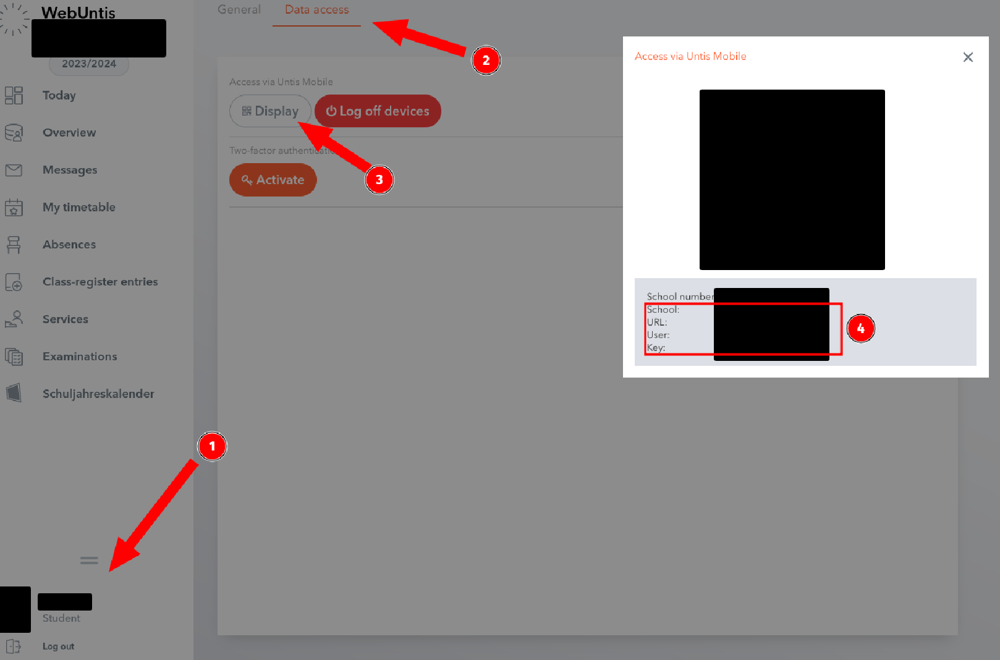

# untisClient

A simple Java library for downloading a timetable from the Untis WebRTC-API

## Installation with Gradle

1. Download the jar file from [Github Releases](https://github.com/Letsric/untisClient/releases/)
2. Put it into a lib/ folder
   
   Example project layout:
   ```
   .
   ├── app
   │   ├── build.gradle
   │   ├── lib
   │   │   └── untisClient-1.0.0.jar
   │   └── src
   │       ├── main
   │       │   ├── java
   │       │   │   └── org
   │       │   │       └── example
   │       │   │           └── App.java
   │       │   └── resources
   │       └── test
   │           ├── java
   │           │   └── org
   │           │       └── example
   │           │           └── AppTest.java
   │           └── resources
   ├── gradle
   │   ├── libs.versions.toml
   │   └── wrapper
   │       ├── gradle-wrapper.jar
   │       └── gradle-wrapper.properties
   ├── gradlew
   ├── gradlew.bat
   └── settings.gradle
   ```

3. Add these dependencies to `build.gradle`:
   
   ```groovy
   dependencies {
       // The lib itself
       implementation files("lib/untisClient-1.0.0.jar")

       // Dependencies needed by it
       implementation 'com.github.bastiaanjansen:otp-java:2.0.2'
       implementation 'com.google.code.gson:gson:2.10.1'
   }
   ```

## Usage

### Getting the untis user, key, school and url

1. Log in to webuntis
2. Click on your account (Bottom left)
3. Click on Data Access
4. Click on Display



Note down these values.

If you do not have these options, your school is using a different login system. I can't add support for this as I don't have a account using such a login system. Sorry!

### Example code

```Java
package org.example;

import com.github.Letsric.untisClient.UntisClient;
import com.github.Letsric.untisClient.UntisElementNotFoundException;
import com.github.Letsric.untisClient.parsedTypes.Class;
import com.github.Letsric.untisClient.parsedTypes.Subject;
import com.github.Letsric.untisClient.parsedTypes.Room;
import com.github.Letsric.untisClient.parsedTypes.Teacher;
import com.github.Letsric.untisClient.parsedTypes.Period;
import com.github.Letsric.untisClient.parsedTypes.Timetable;

import java.io.IOException;

public class App {
    public static void main(String[] args) {

        UntisClient untis = new UntisClient(
                "USER", // Put in the values here!
                "KEY",
                "SCHOOL",
                "URL"
        );

        Timetable timetable = null;

        try {
            timetable = untis.getTimeTable("2024-03-20", "2024-03-20"); // Request data from Untis
        } catch (IOException e) {
            // TODO: Handle this error properly
            System.out.println("IOException: " + e);
            System.exit(1);
        } catch (InterruptedException e) {
            // TODO: Handle this error properly
            System.out.println("InterruptedException: " + e);
            System.exit(1);
        } catch (UntisElementNotFoundException e) {
            // TODO: Handle this error properly
            // This error should never happen unless the API changes of the server sends bad data
            System.out.println("UntisElementNotFoundException: " + e);
            System.exit(1);
        }
        assert timetable != null;


        // This just outputs everything to console nicely
        StringBuilder out = new StringBuilder("Timetable\n=========\n");

        for (Period p : timetable.periods) {
            out.append("startDateTime: ").append(p.startDateTime).append("\n");
            out.append("endDateTime: ").append(p.endDateTime).append("\n");
            for (Class c : p.classes) {
                out.append("Class: ").append(c.name).append("\n");
            }
            for (Room r : p.rooms) {
                out.append("Room: ").append(r.name).append(": ").append(r.longName).append("\n");
            }
            for (Subject s : p.subjects) {
                out.append("Subject: ").append(s.longName).append("\n");
            }
            for (Teacher t : p.teachers) {
                out.append("Teacher: ").append(t.firstName).append(" ").append(t.lastName).append("\n");
            }
            out.append("--------\n");
        }

        System.out.println(out);
    }
}
```

Note how the function `getTimeTable` takes two inputs. This is the start Date and the end Date for which you want to get data. If you only want the timetable for one day, just insert the same date (like in the example).

